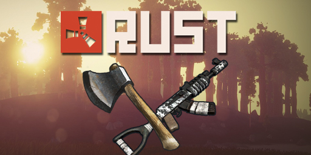

# rust-game-server

<h2>Terraform IaC for dedicated Rust game server in AWS utilizing EC2 and didstopia/rust-server Docker container</h2>

This repository uses Terraform and TravisCI to provision a soup to nuts framework for a Rust game server in AWS and to utilize infrastructure as code with minimal configuration.  The philosophy of use here is to keep resources at a minimum to keep costs down for the average gamer yet still maintain powerful flexibility and to create a framework for which other game servers can be provisioned.

Thanks to [Frank Rosner's article](https://dev.to/frosnerd/continuous-delivery-on-aws-with-terraform-and-travis-ci-3914) for the basis of the CI component.

